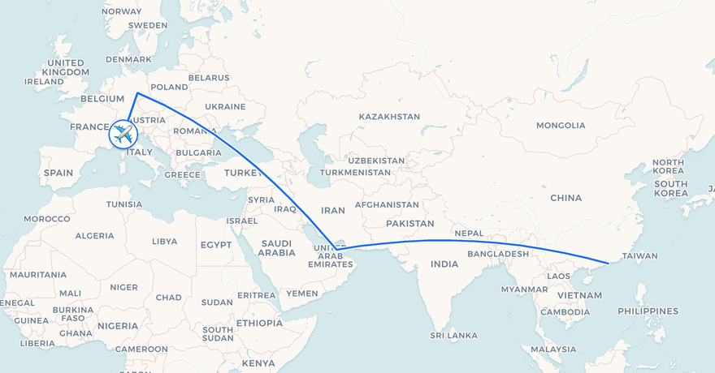
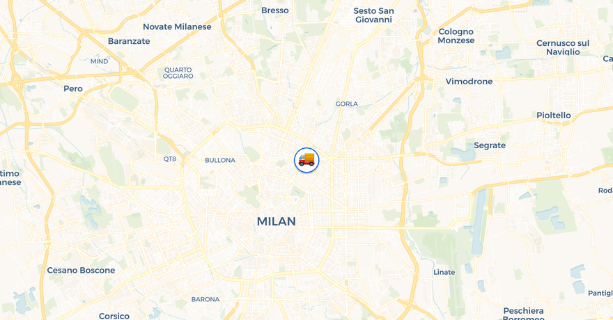

# parcel-tracker-bot

[](https://github.com/SVM-98/parcel-tracker-bot/actions/workflows/ci.yml)
[](https://github.com/SVM-98/parcel-tracker-bot/actions/workflows/security.yml)
[](https://codecov.io/gh/SVM-98/parcel-tracker-bot)
[](LICENSE)
[](https://www.python.org/downloads/)
[](https://github.com/SVM-98/parcel-tracker-bot/pkgs/container/parcel-tracker-bot)

Self-hosted Telegram bot for tracking parcels across **24+ couriers worldwide**, with a plugin
architecture so you can add national couriers without forking the project.

> Built for power users who already run their own infrastructure and want a small, auditable
> tracking bot — no cloud, no SaaS, no third-party data sharing.

<p align="center">
  
  <br>
  <em>Status notifications ship with a route map — rendered by the bot itself, no geocoding API, no keys.</em>
</p>

## Features

- **24 built-in couriers** — DHL, UPS, FedEx, USPS, Royal Mail, La Poste, Deutsche Post,
  Aramex, Australia Post, Canada Post, Correos, Correios, DPD, GLS Europe, Yodel, Evri,
  Bpost, PostNL, Österreichische Post, Swiss Post, Amazon Logistics, China Post, EMS,
  Singapore Post, Japan Post — plus a universal 17track fallback.
- **Plugin extension** — drop a `Tracker` subclass in `plugins/` and the bot picks it up at startup.
- **Auto-detect carrier** — paste a tracking number and the bot resolves the carrier by regex priority.
- **Tracker health & auto-quarantine** — broken couriers get sidelined automatically (3/6/12 fail → 1 h/6 h/24 h).
- **Fine-grained notifications** — toggle per status (delivered, in transit, exception, …) per user.
- **Self-hosted route maps** — notifications can attach a map of the parcel's journey, with the
  transport icon (plane/ship/train/truck) inferred from the checkpoint. Offline GeoNames geocoder
  + public map tiles: no geocoding API, no accounts.
- **Observability** — Prometheus exporter on `:9090/metrics` + structured JSON logs (structlog).
- **i18n** — English and Italian shipped, more via PR. Per-user language via `/lang`.
- **Hardened container** — read-only rootfs, no-new-privileges, dropped capabilities, resource limits.

## Quick start

```bash
git clone https://github.com/SVM-98/parcel-tracker-bot.git
cd parcel-tracker-bot
cp .env.example .env
# Edit .env: TELEGRAM_BOT_TOKEN (required), OWNER_ID (required), optional API keys.
docker compose up -d
docker compose logs -f
```

Talk to your bot on Telegram and send `/start`.

## Supported couriers

| Tier | Couriers | Setup |
|------|----------|-------|
| **Tier S — Direct scrapers** | UPS, USPS, Royal Mail, La Poste, Deutsche Post, Aramex, Australia Post, Canada Post, Correos, Correios, FedEx (with TNT), DPD, GLS Europe, Yodel, Evri, Bpost, PostNL, Österreichische Post, Swiss Post, DHL Express | Zero config |
| **Tier D — Track17-backed detection** | Amazon Logistics, China Post, EMS, Singapore Post, Japan Post | Set `TRACK17_API_KEY` |
| **Universal fallback** | 17track | Set `TRACK17_API_KEY` |

See [docs/trackers.md](docs/trackers.md) for the full table with regex patterns and priorities.

## Route maps

Status updates can carry a rendered map: the checkpoint route as a polyline, with a transport
icon inferred from the courier status (plane / ship / train / truck / parcel).

| In transit (air) | Out for delivery |
|---|---|
|  |  |

Geocoding is **offline** — a bundled GeoNames `cities15000` index resolves both English and
local city names ("Milan" and "Milano") with zero network calls. Tiles default to CARTO's
voyager basemap (English labels, retina `@2x`); any XYZ server works via `OSM_TILE_URL` +
`MAP_TILE_SIZE`. No accounts, no API keys, no third-party geocoding service seeing your parcel
data. Opt out with `MAPS_ENABLED=false`.

Map tiles © [OpenStreetMap](https://www.openstreetmap.org/copyright) contributors, © [CARTO](https://carto.com/attributions).

## Documentation

- [Architecture](docs/architecture.md) — core/plugin design, data flow
- [Plugin tutorial](docs/plugins.md) — write your own tracker in 50 lines
- [Courier API keys](docs/api-keys.md) — DHL, UPS, FedEx, 17track tier-free options
- [Observability](docs/observability.md) — Prometheus + Grafana setup
- [i18n](docs/i18n.md) — add a new language via `.po` file
- [Troubleshooting](docs/troubleshooting.md) — common errors & fixes
- [CHANGELOG](CHANGELOG.md)

## Contributing

Contributions welcome — bug reports, new couriers, translations, doc fixes. See
[CONTRIBUTING.md](CONTRIBUTING.md) for the development setup and PR checklist.

## Security

Found a vulnerability? Please **do not open a public issue**. Read [SECURITY.md](SECURITY.md)
for the disclosure procedure.

## License

MIT — see [LICENSE](LICENSE). Copyright © 2026 SVM-98 and contributors.
